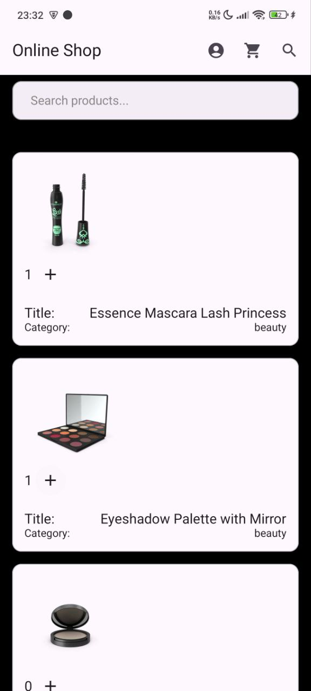
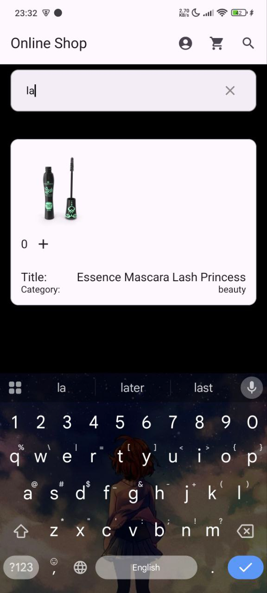
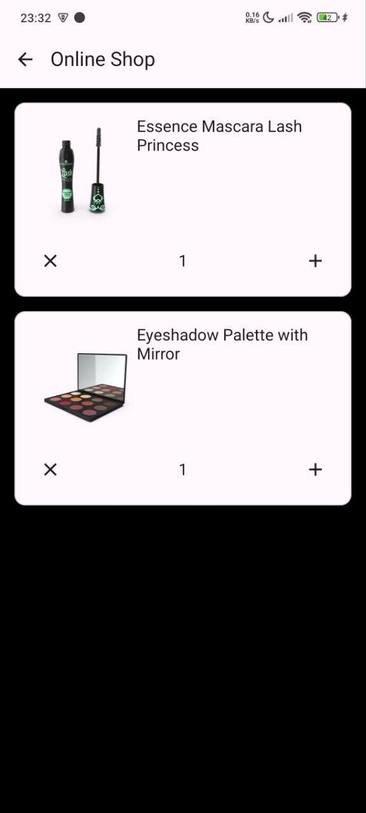
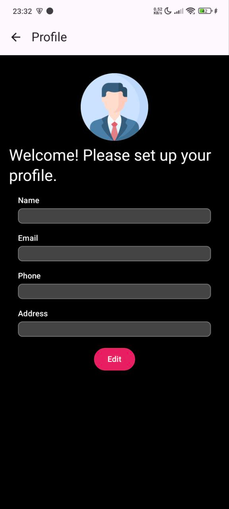
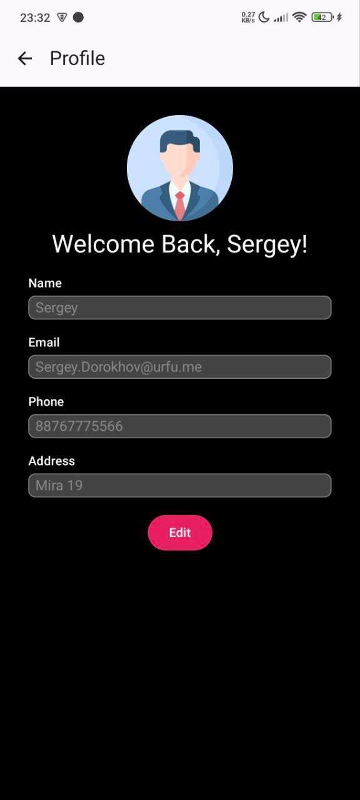
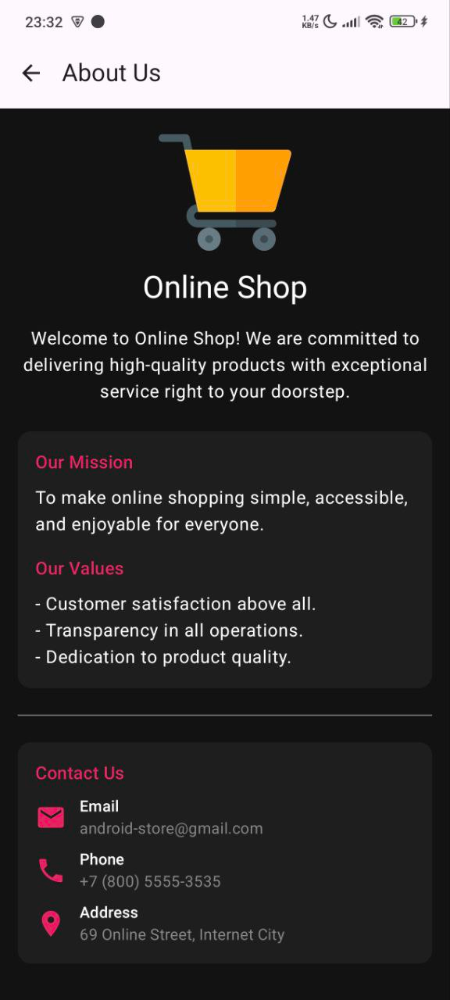

# Online Shop 

## Краткое описание

**Online Shop** — Android‑приложение на основе публичного учебного api. Пользователь листает каталог, ищет товары по имени, добавляет их в корзину и оформляет заказ, а также есть возможность настроить личный профиль.

### CD 
Apk с последними правками можно взять в блоке *релизы* [тут](https://github.com/design-c/android-store/releases).

* Приложение автоматически собирается и публикуется при мерже в *main*. 

---

## 1. Каталог

**Можно:**

* Просматривать список товаров с изображением и описанием.
* Увеличивать/уменьшать количество в корзине кнопками «+» и «–».
* Открывать подробную карточку товара тапом по карточке.

## 2. Поиск

**Можно:**

* Фильтровать каталог в реальном времени по введённому названию.
* Сбрасывать поиск.

## 3. Карточка товара

**Можно:**

* Читать информацию о вещи, запрошенную по api.
* Добавлять товар в корзину.

## 4. Корзина

**Можно:**

* Видеть все выбранные позиции с количеством.
* Уменьшать количество или удалять товар кнопкой ✕.
* Менять количество прямо в списке.

## 5. Профиль

**Можно:**

* Заполнять/редактировать имя, e‑mail, телефон и адрес доставки.
* Сохранять изменения.

### Пустой профиль

### Заполненный профиль

## 6. О нас

**Можно:**

* Узнать информацию о магазине.
* Скопировать контактные данные.

---

### Видео демо

Демонстрация: [video.mp4](imgs/video.mp4)

